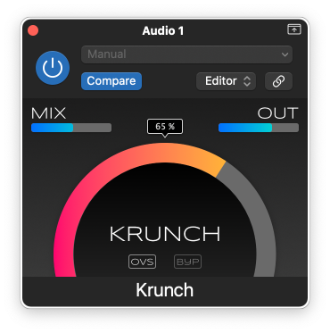

# Krunch

This is a combination low-pass filter and saturation plug-in. It's based on the **1€ Filter**, an adaptive filter designed to balance jitter and lag in noisy input for interactive systems. When applied to audio, this filter dynamically adds harmonics in an interesting way.



How to use this plug-in:

- **KRUNCH** The higher this is dialed up, the more the sound will be filtered. But even at low values it will already add crunch.

- **MIX** The effect works best when some dry signal is mixed in. For example, set KRUNCH to 75% and MIX to 50% to make kicks stand out more.

- **OUT** Since this is a filter, the output signal may end up being a tad quieter. Compensate the drop in loudness with this slider.

- **OVS** Enable oversampling. Gives a cleaner result because fewer aliases, but if you think aliases have a charm of their own you may want to leave this disabled.

- **BYP** Bypass the plug-in for A/B testing.

Suggested workflow: Set MIX to 100%, dial KRUNCH to where it sounds nasty, then reduce MIX again to bring some of the high end back. Toggle BYP to compare and bring up OUT to equalize the loudness. Adding just a bit of subtle saturation is usually enough!

## Installation instructions

Download the latest version from the [Releases page](https://github.com/hollance/krunch/releases).

Extract the downloaded ZIP file.

On Mac:

- copy **Krunch.component** to the folder **/Library/Audio/Plug-Ins/Components**
- copy **Krunch.vst3** to the folder **/Library/Audio/Plug-Ins/VST3**

On Windows:

- copy **Krunch.vst3** to the folder **C:\Program Files\Common Files\VST3**

In your DAW, look for **audiodev.blog > Krunch**. You can insert this plug-in on a stereo track.

## How to build the plug-in

Krunch is written using JUCE 7.0.12. It should compile OK with JUCE 8 too but I didn't try that yet.

This project uses CMake. It assumes a global installation of JUCE.

On macOS:

```bash
cmake -B build -G Xcode -D"CMAKE_OSX_ARCHITECTURES=arm64;x86_64"
```

Then open **build/Krunch.xcodeproj** in Xcode and build the VST3 and/or AU targets.

On Windows:

```text
cmake -B build -G "Visual Studio 17 2022" -DCMAKE_INSTALL_PREFIX=\path\to\JUCE\cmake\install
```

Then open **build/Krunch.sln** in Visual Studio and build the VST3 project.

[Read more about how this plug-in works on my blog](https://audiodev.blog/krunch/)

## Credits & license

Copyright (C) 2024 M.I. Hollemans

This program is free software: you can redistribute it and/or modify it under the terms of the [GNU General Public License](https://www.gnu.org/licenses/gpl-3.0.en.html) as published by the Free Software Foundation, either version 3 of the License, or (at your option) any later version.

The filter used in this plug-in is based on the paper [1€ Filter: A Simple Speed-based Low-pass Filter for Noisy Input in Interactive Systems](https://gery.casiez.net/1euro/) by Géry Casiez, Nicolas Roussel and Daniel Vogel (2012).

JUCE is copyright © Raw Material Software.

VST® is a trademark of Steinberg Media Technologies GmbH, registered in Europe and other countries.
